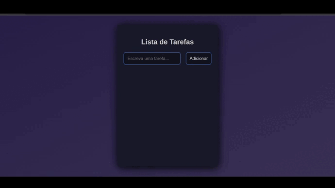

## TO-DO LIST

### Projeto desenvolvido como desafio referente ao módulo 2 do curso Vai na Web de desenvolvimento Front-End.   

Neste projeto, construi uma pequena aplicação no estilo "Lista de Tarefas" usando o React JS.

  

## PREVIEW DO PROJETO:

  

 

    

